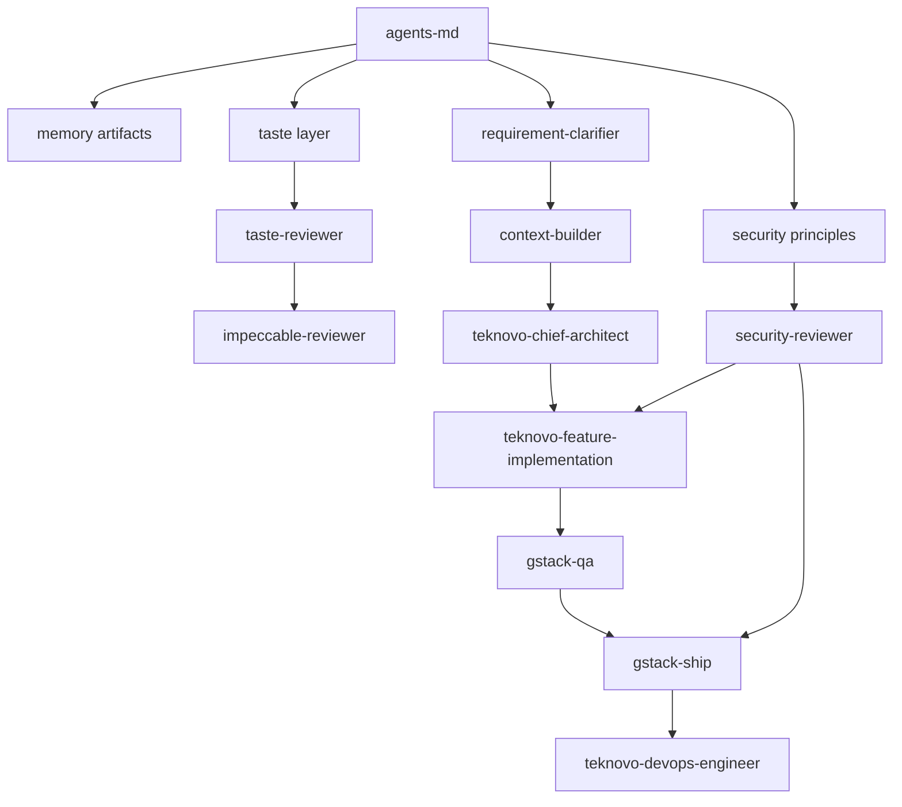

# Teknovo Skill Governance

> **Canonical registry**: `.cursor/registry/skill-registry.yaml`  
> **Agent mapping**: `.cursor/registry/agent-registry.yaml`  
> **MCP integrations**: `.cursor/registry/mcp-registry.yaml`  
> **Last updated**: 2026-06-20

This document defines how skills are discovered, activated, prioritized, and resolved when conflicts arise in the Teknovo AI SuperStack. It is the policy companion to the machine-readable registries.

---

## 1. Architecture Overview

The Teknovo skill system uses a **hub-and-spoke** model:

```text
                    ┌─────────────────────────┐
                    │  .cursor/registry/skill-registry │  ← SINGLE SOURCE OF TRUTH
                    │  (layers, priorities,    │
                    │   activation, conflicts) │
                    └───────────┬─────────────┘
          ┌─────────────────────┼─────────────────────┐
          â–¼                     â–¼                     â–¼
  .cursor/registry/legacy-registry.yaml   Sub-registries          .cursor/registry/
  (legacy autoload)       .cursor/gates/taste/, .cursor/gates/quality/,       agent-registry.yaml
                          .cursor/gates/security/, .cursor/docs/memory/       mcp-registry.yaml
```

**Precedence for orchestration**: `.cursor/registry/skill-registry.yaml` overrides informal references. `.cursor/registry/legacy-registry.yaml` remains for backward compatibility — it points to the canonical registry and must not diverge on autoload IDs.

---

## 2. Document and Skill Precedence

When guidance conflicts, apply this order (embedded in `skill-registry.yaml` → `conflict_resolution`):

| Rank | Source | Wins over |
|------|--------|-----------|
| 1 | `AGENTS.md` + `docs/adr/**` | Everything below |
| 2 | Master PRD | Module drafts, external blogs |
| 3 | Teknovo standards (DB, API, RBAC, design, coding) | Ad-hoc patterns |
| 4 | `.cursor/registry/skill-registry.yaml` | Legacy registry entries |
| 5 | Teknovo Skills (`.cursor/skills/teknovo-*`) | Generic AI defaults |
| 6 | Security layer | Convenience, speed hacks |
| 7 | Assurance layer | Assumed requirements |
| 8 | Impeccable (Quality) layer | Default generation quality |
| 9 | Taste layer | Feature expansion, polish-without-value |
| 10 | External guidance | When contradicting Teknovo contracts |

**Precedence chain (short form)**:

```text
AGENTS.md > ADR > PRD > Teknovo Skills > Security > Assurance > Impeccable > Taste > External
```

---

## 3. Conflict Resolution Rules

### 3.1 Taste vs Feature Expansion → Taste wins

When the taste layer recommends **removal or scope reduction** and quality or product pressure recommends **adding features**, taste wins. Do not polish low-value scope — cut it first.

- **Winner**: `taste-reviewer`, `taste-gates`, taste principle artifacts
- **Load order**: Taste before Impeccable on the same artifact
- **Example**: User asks for a third dashboard tab with no PRD metric → taste gate blocks; propose removal

### 3.2 Security vs Convenience → Security wins

When security requirements (RBAC, audit, validation) conflict with implementation speed, security wins. No mutation endpoint without server-side permission checks.

- **Winner**: `security-reviewer`, `security-gates`, `teknovo-rbac-architect`
- **Verdict required**: APPROVE before implementation; APPROVE before production deploy
- **Example**: "Skip permission check for admin-only UI" → BLOCK

### 3.3 AGENTS.md vs External → AGENTS.md wins

External tutorials, framework defaults, and generic AI patterns that contradict Teknovo contracts (UUID v7, soft deletes, layer isolation) are rejected.

- **Winner**: `agents-md`, `memory-coding-standards`
- **Example**: Auto-increment PK suggestion → reject per AGENTS.md

### 3.4 Assurance vs Assumption → Assurance wins

When requirements are ambiguous or context is incomplete, assurance agents block progress until clarified.

- **Winner**: `requirement-clarifier`, `context-builder`
- **Example**: "Add export" without format, RBAC permission, or audit → clarifier blocks planning

### 3.5 RBAC vs UI-only Auth → Security wins

UI route guards and menu hiding are **supplemental**. Server RBAC on every mutation endpoint is mandatory.

- **Winner**: `security-rbac-security`, `teknovo-rbac-architect`

### 3.6 Taste vs Quality (scope vs excellence)

Documented nuance: **Taste > Quality > default generation** for **scope and simplicity**. Quality enforces **correctness and excellence** after taste approves scope. They are not interchangeable.

| Conflict type | Winner |
|---------------|--------|
| Scope too large | Taste |
| Implementation sloppy after scope approved | Quality |
| Ship without self-critique | Quality (`quality-self-critique`) |

Registered pairwise conflicts in skill registry (examples):

- `taste-product-principles` ↔ `quality-product-principles`
- `taste-gates` ↔ `quality-gates`
- `taste-reviewer` ↔ `impeccable-reviewer` (sequential, not parallel — taste first)

---

## 4. Review Agent Order

For the same change artifact, run review agents in this sequence:

```text
requirement-clarifier
    → context-builder
        → taste-reviewer
            → security-reviewer
                → impeccable-reviewer
                    → differential-reviewer [PLANNED]
                        → second-opinion-reviewer [PLANNED, high-risk only]
```

Skipping a mandatory gate requires explicit user approval documented in the session.

---

## 5. Layer Model

Every skill has **exactly one primary layer** (see `.cursor/registry/skill-registry.yaml` → `layers`):

| Layer | Order | Role |
|-------|------:|------|
| foundation | 1 | Bootstrap contracts |
| memory | 2 | Long-term context |
| product | 3 | PRD, domain, planning |
| ux | 4 | UI/UX implementation |
| architecture | 5 | Schema, API, DDD |
| engineering | 6 | Code, TDD, performance |
| security | 7 | Security gates |
| assurance | 8 | Verification, diff review |
| deployment | 9 | DevOps, ship |
| automation | 10 | Subagents, worktrees |
| review | 11 | QA, code review |
| mcp | 12 | Tool/MCP boundaries |

Layers define **load ordering** and **reporting buckets**, not permission to skip gates.

---

## 6. Priority Model

| Priority | Meaning | Examples |
|----------|---------|----------|
| **critical** | Session or gate-blocking | `agents-md`, `teknovo-rbac-architect`, `teknovo-ui-ux`, Three Pillars, `security-reviewer`, `quality-self-critique` |
| **high** | Autoload or phase-gate recommended | Superpowers planning, GStack eng-review/QA, taste-reviewer, security artifacts |
| **medium** | Trigger-based domain/.cursor/gates/taste/quality | Domain modules (PPDB, finance), taste principles |
| **optional** | Specialist, experimental | `superpowers-using-git-worktrees`, `gstack-retro` |

When multiple skills match a trigger, prefer **higher priority** first, then **lower layer order number**.

---

## 7. Activation Rules

### 7.1 Mechanisms

| Mechanism | Config location | Runtime |
|-----------|-----------------|---------|
| Autoload | `skill-registry.yaml` → `autoload` | Session start |
| Keyword trigger | `skills.*.activate_when` | `load-skills.py --trigger "..."` |
| Bundle | `skill-registry.yaml` → `bundles` | `load-skills.py --bundle pre-ship` |
| Agent chain | `agent-registry.yaml` → `agent_chains` | Parent agent orchestration |
| Sub-registry bundle | `.cursor/gates/taste/.cursor/gates/quality/security-registry.yaml` | `load-memory.py --taste-bundle` |

### 7.2 Trigger Matching

The loader normalizes text and matches if:

1. Trigger phrase is substring of query (or reverse)
2. Significant words (>3 chars) from trigger appear in query

Example: trigger `"RBAC permission"` matches user message `"add new permission for finance export"`.

### 7.3 Dependency Expansion

By default, resolving a skill also loads its `depends_on` chain (e.g., `teknovo-feature-implementation` → `teknovo-chief-architect` → `agents-md`). Disable with `--no-deps`.

### 7.4 Planned Skills

Skills with `status: planned` (e.g., `differential-reviewer`) register triggers and dependencies but may not have files yet. Loader emits warnings and placeholder content.

---

## 8. Dependency Graph (Conceptual)



**Hard dependencies (blocking)**:

- No UI implementation without Pillar 1 (`teknovo-chief-product-designer`)
- No code/migrations without Pillar 2 + `security-reviewer` APPROVE
- No production deploy without Pillar 3 + pre-deploy security

---

## 9. MCP Governance

MCP integrations are tracked in `.cursor/registry/mcp-registry.yaml`:

| Risk | Policy |
|------|--------|
| low | Read-only fetch/search — autoload `security-ai-agent-security` awareness |
| medium | Repo write, git — user approval for destructive ops |
| high | Shell, GitHub write, DB read — security review recommended |
| critical | Cloudflare write, production secrets — `security-reviewer` APPROVE required |

**Configured today**: filesystem, git, shell, web-fetch, web-search (Cursor native).

**Planned [PLANNED]**: github-mcp, cloudflare-mcp, postgres-mcp, qdrant-mcp, slack-mcp, linear-mcp, sentry-mcp, datadog-mcp, playwright-mcp, ollama-mcp.

---

## 10. How to Add a New Skill

### Step 1 — Create the artifact

- **Teknovo skill**: `.cursor/skills/teknovo-{name}/SKILL.md`
- **Superpowers/GStack**: `.cursor/skills/{family}/{name}/SKILL.md`
- **Principle/gate**: `{taste,quality,security,assurance}/{name}.md`
- **Review agent**: `agents/{name}.md`

Follow existing SKILL.md structure. No placeholder TODOs.

### Step 2 — Register in canonical registry

Add entry under `.cursor/registry/skill-registry.yaml` → `skills`:

```yaml
  teknovo-new-module:
    id: teknovo-new-module
    layer: product          # exactly one primary layer
    priority: medium        # critical | high | medium | optional
    source: teknovo
    path: .cursor/skills/teknovo-new-module/SKILL.md
    depends_on: [agents-md, memory-product-context]
    activate_when: [keyword1, keyword2]
    conflicts: []
    description: One-line purpose
    autoload: false
```

### Step 3 — Update sub-registry (if applicable)

If the skill belongs to taste, quality, security, or memory, also add to the domain `*-registry.yaml` artifact list and bundles.

### Step 4 — Map agents (if review/pillar agent)

Add to `.cursor/registry/agent-registry.yaml` under `agents:` with `skills.required` / `recommended`.

### Step 5 — Legacy sync (minimal)

If autoload or commonly triggered, add ID to `.cursor/registry/legacy-registry.yaml` → `autoload` or appropriate phase section **or** rely on canonical pointer only for on-demand skills.

### Step 6 — Document and validate

1. Add row to `.cursor/docs/ai/skill-inventory.md`
2. Run `python .cursor/runtime/load-skills.py --validate`
3. Run `python .cursor/runtime/load-skills.py --trigger "your keywords"`

### Step 7 — MCP (if external tool)

Register in `.cursor/registry/mcp-registry.yaml` with `risk_level` and `required_permissions`.

---

## 11. Skill Discovery for Agents

**Every session**:

1. Read `AGENTS.md` (foundation)
2. Resolve autoload from `.cursor/registry/skill-registry.yaml`
3. Match user intent → `--trigger` or agent `activate_when`
4. Load memory context: `python .cursor/runtime/load-memory.py`
5. Load phase bundles as needed:
   - Taste: `--include-taste --taste-bundle pre-feature`
   - Quality: `--include-quality --quality-bundle pre-ship`
   - Skills: `python .cursor/runtime/load-skills.py --bundle pre-implementation`

**Agent persona lookup**:

```text
.cursor/registry/agent-registry.yaml → agents.{id}.skills → skill IDs → skill-registry.yaml → paths
```

---

## 12. Gaps and Planned Work

| Item | Status |
|------|--------|
| `agents/differential-reviewer.md` | [PLANNED] |
| `agents/second-opinion-reviewer.md` | [PLANNED] |
| `.cursor/gates/assurance/assurance-registry.yaml` | Active — assurance bundles |
| `load-memory.py --include-security` | [PLANNED] — use skill loader + security-registry manually |
| github-mcp, cloudflare-mcp | [PLANNED] |
| postgres-mcp, qdrant-mcp | [PLANNED] |

---

## 13. Related Documents

| Document | Purpose |
|----------|---------|
| `.cursor/registry/README.md` | Registry architecture quick reference |
| `.cursor/docs/ai/skill-inventory.md` | Full skill catalog |
| `.cursor/docs/ai/AI_ARCHITECTURE.md` | AI system architecture |
| `.cursor/docs/ai/AI_WORKFLOW.md` | Development workflow |
| `.cursor/gates/taste/taste-registry.yaml` | Taste bundles |
| `.cursor/gates/quality/quality-registry.yaml` | Quality bundles |
| `.cursor/gates/security/security-registry.yaml` | Security bundles |
