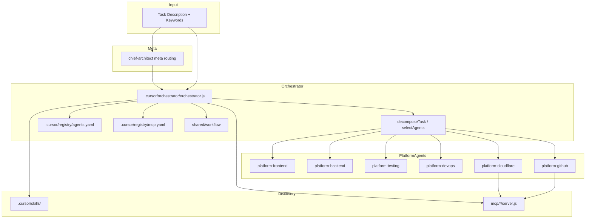
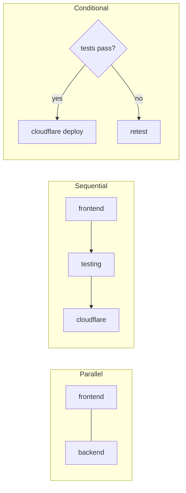

# Teknovo Multi-Agent Platform Architecture

## Overview



## Agent Split Architecture

Each platform agent exposes a **5-file contract**:

| File | Purpose |
|------|---------|
| `agent.yaml` | Discovery metadata, dependencies, MCP requirements |
| `capabilities.yaml` | Capabilities and skill path references |
| `workflow.yaml` | Sequential, parallel, conditional patterns |
| `system-prompt.md` | Runtime system prompt |
| `README.md` | Human-readable overview |

Legacy `AGENT.md` and `config.yaml` are preserved and integrated.

## Workflow Execution Modes



### Orchestrator API

| Function | Purpose |
|----------|---------|
| `decomposeTask()` | Split compound tasks by domain keywords |
| `selectAgents()` | Resolve agents with contracts and MCPs |
| `runParallel()` | Concurrent execution with failure isolation |
| `runSequential()` | Ordered execution with dependency gates |
| `runConditional()` | Branch on runtime conditions |
| `executeWorkflow()` | Declarative workflow runner |
| `onAgentFailure()` | Isolate, retry (max 10), aggregate partial results |
| `aggregateResults()` | Merge succeeded/failed agent outputs |

## Task Flow

1. **Ingress** — Task arrives with description and optional keywords/domain
2. **Decompose** — Orchestrator splits compound tasks into domain subtasks
3. **Route** — Score agents in `.cursor/registry/agents.yaml` by keyword match
4. **Discover** — Skills from `.cursor/skills/`, MCPs from `mcp/` and `.cursor/registry/mcp.yaml`
5. **Execute** — Parallel, sequential, or conditional via `shared/workflow`
6. **Recover** — Failed agents isolated; unaffected agents continue; max 10 retries
7. **Aggregate** — Partial results merged for downstream steps

## Agent Types

| Type | Examples | Role |
|------|----------|------|
| meta | chief-architect | Architecture routing entry |
| platform | orchestrator, frontend, backend, devops, testing, cloudflare, github | Domain specialists |
| review | taste, security, impeccable | Quality gates |
| assurance | requirement-clarifier, context-builder | Pre-implementation |
| pillar | chief-product-designer, chief-architect, devops-engineer | Teknovo Three Pillars |

## Platform Agents

| Agent | Path | Domain | MCP |
|-------|------|--------|-----|
| Orchestrator | `.cursor/orchestrator/` | Routing, decomposition, coordination | — |
| Frontend | `agents/frontend/` | Next.js, React, Tailwind, UI | filesystem |
| Backend | `agents/backend/` | REST, DB, RBAC | filesystem, git |
| Testing | `agents/testing/` | Unit, E2E, Lighthouse | filesystem, shell |
| DevOps | `agents/devops/` | CI/CD, pipelines | shell, git |
| Cloudflare | `agents/cloudflare/` | Pages, DNS, SSL, deploy | cloudflare-mcp |
| GitHub | `agents/github/` | PR, releases, issues | github-mcp |

## Example Workflows

**Frontend → Testing → Cloudflare**

```js
await runSequential([
  { id: 'frontend', agentId: 'platform-frontend', task: { description: 'Build UI' } },
  { id: 'testing', agentId: 'platform-testing', task: { description: 'E2E' }, dependsOn: ['frontend'] },
  { id: 'deploy', agentId: 'platform-cloudflare', task: { description: 'Deploy' }, dependsOn: ['testing'] },
]);
```

**Frontend + Backend parallel → Testing**

```js
await runParallel([
  { agentId: 'platform-frontend', task: { description: 'UI' } },
  { agentId: 'platform-backend', task: { description: 'API' } },
]);
await runSequential([
  { id: 'testing', agentId: 'platform-testing', task: { description: 'Verify' } },
]);
```

## MCP Integration

| Server | Secret Path | Risk | Agent |
|--------|-------------|------|-------|
| github-mcp | `github.env` → GITHUB_TOKEN | high | platform-github |
| cloudflare-mcp | `cloudflare.env` | critical | platform-cloudflare |
| filesystem-mcp | none | medium | all |
| git-mcp | none | medium | backend, devops, github |

## Shared Libraries

- **secret-store** — Wraps `mcp/shared/secrets.js` with platform status API
- **logging** — Structured JSON logs with secret masking
- **validation** — Zod schemas for tasks and workflow steps
- **workflow** — Step runner with retry and parallel coordination

## Registry Split

| File | Role |
|------|------|
| `.cursor/registry/agents.yaml` | Platform + reviewer agents (v2.1) |
| `.cursor/registry/skills.yaml` | Index to canonical skill-registry.yaml |
| `.cursor/registry/mcp.yaml` | MCP tools, secret paths, risk levels |
| `.cursor/registry/agent-registry.yaml` | Legacy full agent map |
| `.cursor/registry/mcp-registry.yaml` | Legacy full MCP map |

## Failure Recovery

Aligned with `.cursor/gates/execution/execution-registry.yaml`:

- `max_retries: 10`
- `isolate_failures: true` — failed agent does not stop unaffected parallel agents
- `continue_unaffected: true`
- Orchestrator uses `shared/workflow/WorkflowEngine` and `onAgentFailure()`

## Security

- No secrets in code or logs
- MCP write operations require security-reviewer APPROVE
- Secret store paths: `/root/.config/teknovo/secrets/` (Linux)
