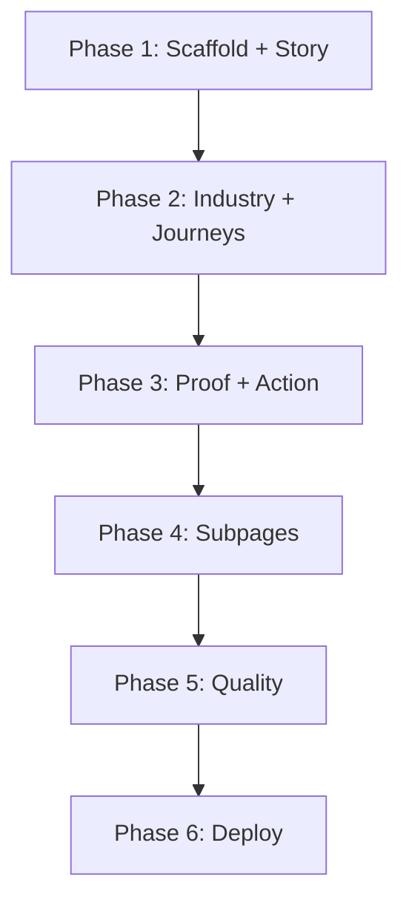

# SMK Teknovo Portal — Phase Task Breakdown

**Companion to:** [`smk-teknovo-portal-evolution.md`](./smk-teknovo-portal-evolution.md)

---

## Phase 1: Foundation & Opening Chapters (Sesi Ini)

**Goal:** Scaffold modern stack, deliver Story + Transformation immersive chapters.

### Tasks

| # | Task | Owner Skill | Deps | Est. |
|---|------|-------------|------|------|
| 1.1 | Create gate artifacts (brand → ui-ux) | Orchestrator | — | 1h |
| 1.2 | Init `apps/immersive-portal/` Vite + React + TS strict | feature-implementation | 1.1 | 1h |
| 1.3 | Install R3F, Drei, GSAP, Lenis, Motion | design-system | 1.2 | 0.5h |
| 1.4 | Design tokens CSS (Deep Space palette) | design-system | 1.2 | 0.5h |
| 1.5 | Lenis root + GSAP ScrollTrigger registration | motion-designer | 1.3 | 0.5h |
| 1.6 | Navigation + scroll progress indicator | ux-architecture | 1.5 | 0.5h |
| 1.7 | StoryScene3D — ecosystem network R3F | 3d-experience-architect | 1.3 | 1.5h |
| 1.8 | Story DOM chapter — copy + motion reveal | landing-page | 1.7 | 1h |
| 1.9 | Transformation chapter — scroll transition | landing-page | 1.8 | 1h |
| 1.10 | Build pipeline: Vite → public merge | devops | 1.2 | 0.5h |
| 1.11 | Update validate.js for new anchors | testing | 1.10 | 0.5h |
| 1.12 | `npm run build` verification | verification | 1.11 | 0.25h |

### Acceptance Criteria

- [ ] `apps/immersive-portal/` builds without TS errors
- [ ] Homepage renders 3D Story scene (not flat hero)
- [ ] Scroll from Story → Transformation with motion continuity
- [ ] Lenis smooth scroll active (respects reduced-motion)
- [ ] Static subpages (`/ppdb/`, `/program/`) still load
- [ ] `npm run build` exits 0

---

## Phase 2: Core Narrative Chapters

**Goal:** Industry Alignment, Student Journey, Career Journey.

| # | Task | Est. | Status |
|---|------|------|--------|
| 2.1 | Industry chapter — TKJ/RPL/DKV 3D objects | 3h | ✅ Complete |
| 2.2 | Student Journey — timeline motion | 2h | ✅ Complete |
| 2.3 | Career Journey — data motion (no KPI grid) | 2h | ✅ Complete |
| 2.4 | Motion Design Review formal score ≥80 | 1h | ✅ Score 84 |
| 2.5 | 3D Experience Review formal score ≥85 | 1h | ✅ Score 87 |
| 2.6 | Mobile fallback testing all chapters | 2h | ⚠️ Partial — CSS degradation done; formal device QA Phase 5 |

**Acceptance:** 5 chapters scroll seamlessly; motion + 3D scores pass. ✅

---

## Phase 3: Conversion & Proof

**Goal:** Proof, Action (PPDB), FAQ, Contact; unify navigation.

| # | Task | Est. | Status |
|---|------|------|--------|
| 3.1 | Proof chapter — editorial achievements | 2h | ✅ Complete |
| 3.2 | Action chapter — PPDB dominant CTA | 1.5h | ✅ Complete |
| 3.3 | FAQ accordion with motion | 1h | ✅ Complete |
| 3.4 | Contact section + form (port from static) | 1.5h | ✅ Complete |
| 3.5 | Shared nav links to static subpages | 1h | ✅ Complete |
| 3.6 | Program pages visual refresh (static enhanced) | 4h | ⏳ Phase 4 |

**Acceptance:** Full 7-beat sequence; PPDB conversion path ≤2 clicks from any chapter. ✅

---

## Phase 4: Subpage Migration

**Goal:** PPDB funnel, Berita, Program pages consistent with immersive brand.

| # | Task | Est. |
|---|------|------|
| 4.1 | PPDB page — conversion-optimized flow | 4h |
| 4.2 | Berita index + detail — editorial layout | 3h |
| 4.3 | Program detail pages — industry 3D micro-scenes | 6h |
| 4.4 | Sitemap + SEO update | 1h |

---

## Phase 5: Quality & Originality

**Goal:** AI-ish ≥85, performance hardening, accessibility audit.

| # | Task | Est. |
|---|------|------|
| 5.1 | AI-ish Review — score and remediate | 2h |
| 5.2 | Lighthouse perf optimization | 3h |
| 5.3 | Reduced-motion + a11y audit | 2h |
| 5.4 | Cross-browser QA (gstack-browser-testing) | 2h |
| 5.5 | JSON-LD + meta tags verification | 1h |

---

## Phase 6: Deploy

**Goal:** Production on Cloudflare.

| # | Task | Est. |
|---|------|------|
| 6.1 | Wrangler deploy config verify | 0.5h |
| 6.2 | Production smoke test | 1h |
| 6.3 | Analytics / monitoring (optional) | 1h |

---

## Dependency Graph

---

## Effort Summary

| Phase | Hours (est.) |
|-------|--------------|
| 1 | 8–10 |
| 2 | 11–13 |
| 3 | 11–13 |
| 4 | 14–18 |
| 5 | 10–12 |
| 6 | 2–4 |
| **Total** | **56–70** |
