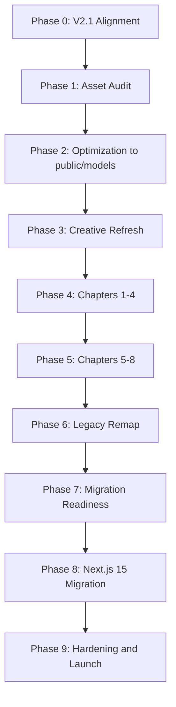

# SMK Teknovo Portal — Breakdown Fase PRD V2.1

**Companion to:** [`smk-teknovo-portal-evolution.md`](./smk-teknovo-portal-evolution.md)  
**PRD Baseline:** V2.1 (Approved)  
**Asset audit deliverable:** [`docs/artifacts/smk-teknovo/assets-report.json`](../artifacts/smk-teknovo/assets-report.json)

---

## Prinsip Fase V2.1

Roadmap fase mengikuti urutan PRD V2.1:

1. **Asset audit** — inventaris dan baseline performa 3D
2. **Pipeline optimization** — output ke `/public/models`
3. **Creative refresh** — brand, motion, 3D, UX artifacts
4. **Chapter rebuild** — narasi 8 chapter di stack transisi (Vite)
5. **Migration readiness + Next.js 15** — Cloudflare Pages launch

**Design order:** Story First → Motion Second → 3D Third → Technology Last  
**Primary message:** Belajar. Berkarya. Siap Industri.  
**Deploy:** Cloudflare Pages + `/public/models` — **no R2** for landing

---

## Phase 0: PRD V2.1 Alignment

**Goal:** Menyelaraskan roadmap, baseline teknis, dan keputusan migrasi terhadap PRD V2.1.

| # | Task | Owner | Deps | Est. | Status |
|---|------|-------|------|------|--------|
| 0.1 | Audit roadmap V2.0 vs PRD V2.1 | Product / UX | — | 0.5d | ✅ |
| 0.2 | Tetapkan urutan chapter V2.1 (Industry Challenge, Industry Alignment) | Product Designer | 0.1 | 0.25d | ✅ |
| 0.3 | Tetapkan primary message dan design order | Brand / Product | 0.1 | 0.25d | ✅ |
| 0.4 | Tetapkan keputusan transisi Vite / target Next.js 15 | Architecture | 0.2 | 0.25d | ✅ |
| 0.5 | Dokumentasikan deploy Cloudflare Pages + no R2 | DevOps | 0.3 | 0.25d | ✅ |
| 0.6 | Reconcile teknovo-asset-studio sebagai internal tool opsional | Architecture | 0.5 | 0.25d | ✅ |

### Output wajib

- roadmap utama align ke PRD V2.1
- constraint R2 vs static deploy tertulis jelas
- Vite interim vs Next.js 15 target tidak kontradiktif

---

## Phase 1: 3D Asset Audit (PRD Phase 1)

**Goal:** Inventaris semua asset 3D di `/3d`, analisis format/size/triangle/texture, estimasi optimasi.

| # | Task | Owner | Deps | Est. | Status |
|---|------|-------|------|------|--------|
| 1.1 | Scan `/3d` directory — file type, size, texture count | 3D / Pipeline | Phase 0 | 0.5d | ✅ |
| 1.2 | Run `teknovo-3d-pipeline analyze` pada asset convertible | 3D Pipeline | 1.1 | 0.5d | ✅ |
| 1.3 | Map assets ke chapter V2.1 | 3D Experience Architect | 1.2 | 0.25d | ✅ |
| 1.4 | Generate `assets-report.json` | 3D Pipeline | 1.3 | 0.25d | ✅ |
| 1.5 | Flag missing assets (Hotel/Hospitality) dan tooling gaps | Architecture | 1.4 | 0.25d | ✅ |

### Deliverable

- [`docs/artifacts/smk-teknovo/assets-report.json`](../artifacts/smk-teknovo/assets-report.json)

### Acceptance Criteria

- setiap primary asset terdokumentasi: file type, size, texture count, triangle count (jika analyzable), estimated optimization ratio
- chapter-asset mapping V2.1 lengkap
- blockers (Blender missing, Hotel missing, School Building size) teridentifikasi

### Audit summary (20 Jun 2026 — verified)

| Metric | Value |
|--------|-------|
| Primary assets found | 5 / 5 |
| Total source size | 1.73 GB (1,854,143,624 bytes) |
| Files | 184 |
| Pipeline-analyzed | 1 (airport terminal OBJ → GLB) |
| Missing | — (Hotel uploaded 20 Jun 2026) |
| Estimated overall optimization ratio | ~93% (pre-decimation) |
| Verification | ✅ PASS — report corrected for school-building package/texture bytes |

---

## Phase 2: 3D Optimization → `/public/models` (PRD Phase 2)

**Goal:** Optimasi asset via `tools/teknovo-3d-pipeline`, output ke `/public/models` siap Cloudflare Pages.

**Status:** 🟡 **PARTIAL** (21 Jun 2026) — 2/5 primary assets production-ready; see [`optimization-report.json`](../artifacts/smk-teknovo/optimization-report.json)

| # | Task | Owner Skill | Deps | Est. | Status |
|---|------|-------------|------|------|--------|
| 2.1 | Install/unblock conversion tools (Blender CLI, assimp) | DevOps / 3D | Phase 1 | 0.5d | ✅ Blender 4.0.2 + assimp 5.3 + FBX2glTF 0.13.1 |
| 2.2 | Export `.max`, SolidWorks, STEP → GLB/OBJ | 3D Artist / CAD | 2.1 | 1–2d | ⏸️ blocked — CAD export required (tooling cannot read native formats) |
| 2.3 | Run `optimize` + LOD chain per asset | teknovo-3d-pipeline | 2.2 | 1d | ✅ tourism-airport, hotel-hospitality |
| 2.4 | Mesh decimation untuk assets >40K triangles | 3D Pipeline | 2.3 | 0.5d | 🟡 LOD chains ok; triangles still high (964K airport, 770K hotel) |
| 2.5 | Write optimized GLB + `model-manifest.json` → `/public/models` | 3D Pipeline | 2.4 | 0.5d | ✅ tourism-airport, hotel-hospitality |
| 2.6 | Validate against budgets: hero 15MB, standard 8MB, mobile 5MB | 3D + QA | 2.5 | 0.5d | ✅ validated |
| 2.7 | Procure or substitute Hotel/Hospitality asset | Product / 3D | Phase 1 | TBD | ✅ uploaded (FBX hallway) |

### Output layout

```text
public/models/
├── school-building/
│   ├── school-building-lod0.glb
│   ├── school-building-lod1.glb
│   └── model-manifest.json
├── cnc-lathe/
├── gear-eureka/
├── tourism-airport/          ✅ lod0–lod3 + manifest
└── hotel-hospitality/        ✅ lod0–lod3 + manifest
```

### Acceptance Criteria

- optimized assets in `/public/models` with manifest per asset
- hero asset ≤15 MB, standard ≤8 MB, mobile LOD ≤5 MB
- total initial load budget ≤25 MB documented
- **no R2** dependency for landing asset delivery

### Blockers (updated 21 Jun 2026)

- ~~Blender CLI not installed~~ — ✅ resolved
- **school-building** `.max` — Blender has no native importer; requires 3ds Max → GLB export (1.47 GB source)
- **cnc-lathe** `.SLDASM` — assimp cannot read SolidWorks; requires simplified SolidWorks export
- **gear-eureka** `.STEP` — assimp fails AUTOMOTIVE_DESIGN schema; requires FreeCAD/SolidWorks export
- Airport 964K + hotel 770K triangles — needs mesh decimation beyond compression

### Phase 2 summary (21 Jun 2026)

| Metric | Value |
|--------|-------|
| Production-ready packs | 2 (`tourism-airport`, `hotel-hospitality`) |
| Output paths | `public/models/tourism-airport/`, `public/models/hotel-hospitality/` |
| Blocked stubs | `school-building`, `cnc-lathe`, `gear-eureka` (`conversion-required.json` each) |
| Tooling | Blender 4.0.2, assimp 5.3, FBX2glTF 0.13.1 — all on PATH |
| Pipeline build | ✅ `npm run build` pass |
| Budget validation | lod0 hero/standard pass; lod0 mobile fail for both optimized packs; lod2–lod3 mobile pass |
| Recommended mobile load | 4.9 MB combined (airport lod3 1.6 MB + hotel lod3 3.3 MB) |
| CAD adapter stubs | `tools/teknovo-3d-pipeline/adapters/cad-formats.json` |

---

## Phase 3: Creative Refresh PRD V2.1

**Goal:** Memperbarui artifact strategi dan desain untuk V2.1 — primary message, chapter names, design order.

**Status:** ✅ **COMPLETE** (21 Jun 2026)

| # | Task | Owner Skill | Deps | Est. | Status |
|---|------|-------------|------|------|--------|
| 3.1 | Revisi `brand-alignment` — **Belajar. Berkarya. Siap Industri.** | brand-dna | Phase 0 | 0.5d | ✅ |
| 3.2 | Revisi creative direction — Story First design order | creative-director | 3.1 | 0.5d | ✅ |
| 3.3 | Update four-goal matrix untuk 8 chapter V2.1 | product-designer | 3.2 | 0.5d | ✅ |
| 3.4 | Rename chapters: Industry Challenge, Industry Alignment | ux-architecture | 3.3 | 0.25d | ✅ |
| 3.5 | Revisi motion review — motion before 3D gate | motion-designer | 3.4 | 0.5d | ✅ |
| 3.6 | Revisi 3D review — asset mapping from audit + hotel upload | 3d-experience-architect | Phase 2 | 0.5d | ✅ |
| 3.7 | Update 3D object briefs for Teknik Mesin + ULW | 3d-experience-architect | 3.6 | 0.5d | ✅ |

### Deliverables

| Artifact | Path |
|----------|------|
| Brand alignment | [`docs/artifacts/smk-teknovo/brand-alignment.md`](../artifacts/smk-teknovo/brand-alignment.md) |
| Creative direction | [`docs/artifacts/smk-teknovo/creative-direction.md`](../artifacts/smk-teknovo/creative-direction.md) |
| Product design (four-goal matrix) | [`docs/artifacts/smk-teknovo/product-design.md`](../artifacts/smk-teknovo/product-design.md) |
| UX architecture | [`docs/artifacts/smk-teknovo/ux-architecture.md`](../artifacts/smk-teknovo/ux-architecture.md) |
| Motion review | [`docs/artifacts/smk-teknovo/motion-review.md`](../artifacts/smk-teknovo/motion-review.md) |
| 3D review | [`docs/artifacts/smk-teknovo/3d-review.md`](../artifacts/smk-teknovo/3d-review.md) |
| 3D object briefs | [`docs/artifacts/smk-teknovo/3d-object-briefs.md`](../artifacts/smk-teknovo/3d-object-briefs.md) |
| Updated asset audit (hotel) | [`docs/artifacts/smk-teknovo/assets-report.json`](../artifacts/smk-teknovo/assets-report.json) |

### Acceptance Criteria

- primary message V2.1 konsisten di semua artifact
- chapter names V2.1 (Industry Challenge, Industry Alignment)
- design order Story → Motion → 3D → Technology terdokumentasi
- tidak ada referensi TKJ/RPL/DKV sebagai cerita utama

---

## Phase 4: Rebuild Chapters 1–4 (Vite interim)

**Goal:** Implementasi chapter 1–4 V2.1 di stack transisi (`Vite + React + R3F`), load assets dari `/public/models`.

**Status:** ✅ **COMPLETE** (21 Jun 2026) — `apps/immersive-portal`, build pass

**Release & deploy (21 Jun 2026):**

| Item | Status |
|------|--------|
| Git `main` | `bed961c` — `feat(portal): Phase 4 chapters 1-4 V2.1 immersive rebuild` |
| Semver | **2.2.0** (`package.json`, `CHANGELOG.md`, tag `v2.2.0`) |
| Folder `3d/` | **Tidak di-commit** (~1.8 GB source assets lokal) |
| CI (`ci.yml`) | ✅ pass ([run](https://github.com/SaenaAsColeAllStar/webtest/actions)) |
| Deploy (`deploy.yml` → Wrangler `webtest`) | ❌ gagal — API token auth error [10000]; butuh Workers Scripts Edit permission |
| Production URL | Belum terverifikasi live |
| **Deploy-ready untuk Phase 5** | **Tidak** — perbaiki permission token Cloudflare |

**Aksi DevOps:** Settings → Secrets → `CLOUDFLARE_API_TOKEN`, `CLOUDFLARE_ACCOUNT_ID`; opsional perbaiki `release.yml` (hapus `npm ci --prefix apps/immersive-portal`, gunakan workspaces saja).

| # | Task | Owner Skill | Deps | Est. | Status |
|---|------|-------------|------|------|--------|
| 4.1 | Rework opening → `Future Starts Here` + School Building 3D | landing-page | Phase 2, 3 | 1d | ✅ (placeholder 3D — school-building blocked) |
| 4.2 | Build `Industry Challenge` chapter | product + landing-page | 4.1 | 0.75d | ✅ |
| 4.3 | Build `Teknik Mesin` scene (CNC + gear) | 3d + landing-page | 4.2 | 1d | ✅ (placeholder 3D — CAD blocked) |
| 4.4 | Build `Usaha Layanan Wisata` scene (airport + hospitality) | 3d + landing-page | 4.3 | 1d | ✅ real GLB from `/public/models` |
| 4.5 | Update nav/anchor/progress untuk 8 chapter V2.1 | ux-architecture | 4.4 | 0.5d | ✅ |
| 4.6 | Mobile fallback + reduced-motion untuk chapter 1–4 | motion + QA | 4.4 | 0.5d | ✅ |

### Phase 4 notes

- App: `apps/immersive-portal` — `vite.config.ts` `publicDir` → `../../public` for `/models/` in dev
- Real 3D: `tourism-airport` + `hotel-hospitality` (manifest LOD desktop/mobile)
- Placeholders: `school-building`, `cnc-lathe`, `gear-eureka` until CAD export
- Chapters 5–8: nav IDs present; chapter 5 stub, 6–8 interim relabel

### Acceptance Criteria

- chapter 1–4 V2.1 tampil dalam urutan baru
- 3D loaded from `/public/models` (not R2)
- primary message visible in hero
- `npm run build` lulus

---

## Phase 5: Rebuild Chapters 5–8

**Goal:** Menyelesaikan chapter inti tersisa dan mengunci funnel V2.1.

**Status:** ✅ **COMPLETE** (21 Jun 2026) — `apps/immersive-portal`, build pass

| # | Task | Owner Skill | Deps | Est. | Status |
|---|------|-------------|------|------|--------|
| 5.1 | Build `Industry Alignment` chapter | landing-page | Phase 4 | 0.75d | ✅ |
| 5.2 | Remap `Transformation` → `Student Transformation` | landing-page | 5.1 | 0.75d | ✅ |
| 5.3 | Reframe `Proof` → `Achievements` | content + landing-page | 5.2 | 0.5d | ✅ |
| 5.4 | Finalize `PPDB` chapter | landing-page + PPDB | 5.3 | 0.5d | ✅ |
| 5.5 | FAQ/Kontak sebagai support layer | UX | 5.4 | 0.25d | ✅ |
| 5.6 | Review gates: Motion, 3D, Originality ≥85, Brand ≥90 | review gates | 5.4 | 0.5d | 🟡 prep (formal scoring Phase 9) |

### Phase 5 notes

- Chapters 5–8: full V2.1 implementation (Industry Alignment network map, Student Transformation phases, Achievements editorial, PPDB conversion)
- FAQ updated to Teknik Mesin + ULW; support layer `<aside>` below chapter 8
- Removed legacy `TransformationChapter`, `ProofChapter`, `ActionChapter` component files

### Acceptance Criteria

- 8 chapter V2.1 selesai ✅
- Visual Originality ≥85, Brand Consistency ≥90 — formal gate scoring deferred to Phase 9

---

**Release & deploy (21 Jun 2026 — updated):**

| Item | Status |
|------|--------|
| Git `main` | Phase 5 commit pending push |
| Semver | **2.3.0** (`package.json`, `CHANGELOG.md`) |
| Folder `3d/` | **Tidak di-commit** (~1.8 GB source assets lokal) |
| CI (`ci.yml`) | Pending post-push |
| Deploy (`deploy.yml` → Wrangler `webtest`) | ❌ gagal — `Authentication error [code: 10000]` — token perlu permission **Workers Scripts: Edit** + **Account Settings: Read** |
| Production URL | Belum terverifikasi live — expected `https://webtest.<account-subdomain>.workers.dev` setelah deploy sukses |
| **Deploy-ready untuk Phase 6** | **Tidak** — perbaiki permission API token Cloudflare lalu re-run workflow |

**Aksi DevOps:** Pastikan `CLOUDFLARE_API_TOKEN` punya permission: Account → Workers Scripts → Edit; User → User Details → Read. Verifikasi `CLOUDFLARE_ACCOUNT_ID` cocok dengan akun yang memiliki worker `webtest`.

---

## Phase 4: Rebuild Chapters 1–4 (Vite interim)

**Goal:** Menentukan nasib route lama (`TKJ/RPL/DKV`, berita, PPDB detail).

| # | Task | Decision area | Est. |
|---|------|---------------|------|
| 6.1 | Status route TKJ/RPL/DKV: archive, replace, atau catalog | Product + Content | 0.5d |
| 6.2 | Route baru Teknik Mesin dan ULW | Product + UX | 0.5d each |
| 6.3 | Audit PPDB, Berita, support pages | UX / Content | 0.5d |
| 6.4 | Bersihkan terminology lama dari CTA, nav, metadata | Content / Frontend | 0.5d |

---

## Phase 7: Migration Readiness (Next.js 15 + Cloudflare Pages)

**Goal:** Menyiapkan perpindahan ke target stack PRD V2.1.

| # | Task | Owner | Est. |
|---|------|-------|------|
| 7.1 | Parity audit Vite app vs target Next.js 15 | Frontend / Product | 0.5d |
| 7.2 | Target app structure Next.js 15 + Tailwind | Architecture | 0.5d |
| 7.3 | Token CSS → Tailwind mapping | Design System | 0.5d |
| 7.4 | Cloudflare Pages build/deploy config (static `/public/models`) | DevOps | 0.5d |
| 7.5 | SSR/static/hybrid policy per route | Architecture / SEO | 0.5d |
| 7.6 | Asset loading strategy per chapter from `/public/models` | Frontend Perf | 0.5d |

### Deploy policy

- **Cloudflare Pages** — primary deploy target
- **Assets:** `/public/models` bundled with static build
- **R2:** not required for landing; asset-studio R2 remains optional internal tool

---

## Phase 8: Framework Migration

**Goal:** Port ke Next.js 15 + Tailwind tanpa kehilangan kualitas naratif.

| # | Task | Owner | Est. |
|---|------|-------|------|
| 8.1 | Bootstrap Next.js 15 app | Frontend | 1d |
| 8.2 | Port chapter shell + route architecture | Frontend | 1d |
| 8.3 | Port 3D scenes with lazy/route-aware mounts | Frontend Perf | 1d |
| 8.4 | Port PPDB and support routes | Frontend | 1d |
| 8.5 | Tailwind + token enforcement | Frontend / DS | 0.5d |
| 8.6 | Cloudflare Pages build/deploy integration | DevOps | 0.5d |

---

## Phase 9: Hardening and Launch

**Goal:** Quality gates terakhir sebelum production release.

| # | Task | Est. |
|---|------|------|
| 9.1 | Performance hardening (25MB total initial load) | 0.5d |
| 9.2 | Accessibility + reduced-motion audit | 0.5d |
| 9.3 | Cross-browser QA | 0.5d |
| 9.4 | SEO, metadata, analytics, sitemap | 0.5d |
| 9.5 | Final gate scoring | 0.5d |
| 9.6 | Cloudflare Pages production release | 0.25d |

### Acceptance Criteria

- Motion ≥80, 3D ≥85, Visual Originality ≥85, Brand Consistency ≥90
- Performance budgets met (hero 15MB, standard 8MB, mobile 5MB, total 25MB)
- Cloudflare Pages deployment successful — no R2

---

## Status Fase Lama vs V2.1

| Fase lama (V2.0) | Status V2.1 |
|------------------|-------------|
| Phase 0 Alignment | Expanded → V2.1 alignment ✅ |
| Phase 1 Creative Refresh | **Renumbered → Phase 3** |
| Phase 2 Rebuild 1–4 | **Renumbered → Phase 4** |
| Phase 3 Rebuild 5–8 | **Renumbered → Phase 5** |
| Phase 4 Legacy remap | **Renumbered → Phase 6** |
| Phase 5 Migration readiness | **Renumbered → Phase 7** |
| Phase 6 Framework migration | **Renumbered → Phase 8** |
| Phase 7 Hardening | **Renumbered → Phase 9** |
| *(new)* Phase 1 Asset Audit | **PRD V2.1 Phase 1** ✅ |
| *(new)* Phase 2 Optimization | **PRD V2.1 Phase 2** 🟡 partial (2/5) |

---

## Dependency Graph



---

## Tooling Reconciliation

| Tool | Role in V2.1 | Landing critical path? |
|------|--------------|------------------------|
| `tools/teknovo-3d-pipeline` | Analyze, optimize, LOD → `/public/models` | **Yes** |
| `tools/teknovo-asset-studio` | Internal asset management, optional R2 deploy | **No** |
| `apps/immersive-portal` | Current Vite interim public app | **Yes** (until Phase 8) |
| Cloudflare Pages | Target deploy | **Yes** |
| Cloudflare R2 | Asset-studio optional storage | **No** (landing) |

---

## Estimasi Tingkat Tinggi

| Phase | Hours / effort |
|-------|----------------|
| 0 | 2–4 jam ✅ |
| 1 | 4–6 jam ✅ |
| 2 | 2–4 hari |
| 3 | 2–3 hari ✅ |
| 4 | 3–4 hari ✅ |
| 5 | 2–3 hari ✅ |
| 6 | 2–3 hari |
| 7 | 2–3 hari |
| 8 | 4–6 hari |
| 9 | 2–3 hari |

**Catatan:** Phase 2 tooling complete; remaining duration depends on CAD export from 3ds Max / SolidWorks / FreeCAD for 3 blocked assets.
